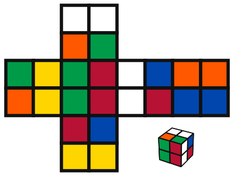
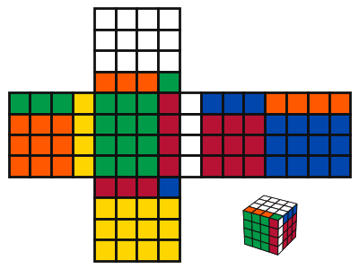

# general_rubik_cube_permutation
General Rubik's Cube permutation generator and visualisation module 

### 2x2x2 Rubik's Cube
```
# State indices, face indices, orientation [U]P [D]OWN [F]RONT [B]ACK [L]EFT [R]IGHT:
          0   1                                   0   0                                   U   U                 
          2   3                                   0   0                                   U   U                 
 20  21   8   9  16  17  12  13           5   5   2   2   4   4   3   3           L   L   F   F   R   R   B   B 
 22  23  10  11  18  19  14  15           5   5   2   2   4   4   3   3           L   L   F   F   R   R   B   B 
          4   5                                   1   1                                   D   D                 
          6   7                                   1   1                                   D   D                 
```




### 4x4x4 Rubik's Cube

```
# State indices, face indices, orientation [U]P [D]OWN [F]RONT [B]ACK [L]EFT [R]IGHT:
                       0    1    2    3                                                                         0    0    0    0                                                                         U    U    U    U                                         
                       4    5    6    7                                                                         0    0    0    0                                                                         U    U    U    U                                         
                       8    9   10   11                                                                         0    0    0    0                                                                         U    U    U    U                                         
                      12   13   14   15                                                                         0    0    0    0                                                                         U    U    U    U                                         
  80   81   82   83   32   33   34   35   64   65   66   67   48   49   50   51             5    5    5    5    2    2    2    2    4    4    4    4    3    3    3    3             L    L    L    L    F    F    F    F    R    R    R    R    B    B    B    B 
  84   85   86   87   36   37   38   39   68   69   70   71   52   53   54   55             5    5    5    5    2    2    2    2    4    4    4    4    3    3    3    3             L    L    L    L    F    F    F    F    R    R    R    R    B    B    B    B 
  88   89   90   91   40   41   42   43   72   73   74   75   56   57   58   59             5    5    5    5    2    2    2    2    4    4    4    4    3    3    3    3             L    L    L    L    F    F    F    F    R    R    R    R    B    B    B    B 
  92   93   94   95   44   45   46   47   76   77   78   79   60   61   62   63             5    5    5    5    2    2    2    2    4    4    4    4    3    3    3    3             L    L    L    L    F    F    F    F    R    R    R    R    B    B    B    B 
                      16   17   18   19                                                                         1    1    1    1                                                                         D    D    D    D                                         
                      20   21   22   23                                                                         1    1    1    1                                                                         D    D    D    D                                         
                      24   25   26   27                                                                         1    1    1    1                                                                         D    D    D    D                                         
                      28   29   30   31                                                                         1    1    1    1                                                                         D    D    D    D                                         
```


